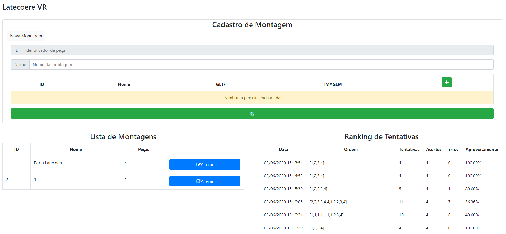

# Lab3 - 3º BD

Professor da Disciplina: Giuliano Bertoti 

Equipe:
- <a href="https://github.com/alexcostabd">Alex Costa Pinto</a> - RA: 1460281913003
- <a href="https://github.com/FelipeNicolettiRMario">Felipe Nicoletti Reis Mario</a> - RA: 1460281913016
- <a href="https://github.com/giraudgabriel"> Gabriel Fernandes Giraud</a> - RA: 1460281913018

<a href="https://latecoere-app.glitch.me/"> ➡ Preview VR

### Área de treinamento da montagem das peças

</a>

<a href="https://latecoere-app.glitch.me/dashboard"> ➡ Preview Dashboard

### Dashboard

</a>

### Para rodar localmente
<code>
    npm install
     
    npm start
</code>

### Tecnologias utilizadas:
- react.js -> frontend
- aframe.js -> vr
- react-aframe -> vr no react
- axios -> chamada pra api
- json-server -> api json
- http-proxy-middleware -> proxy para rodar back e front na mesma porta
- concurrently -> usado pra buildar mais de um server(no caso front e back) ao mesmo tempo